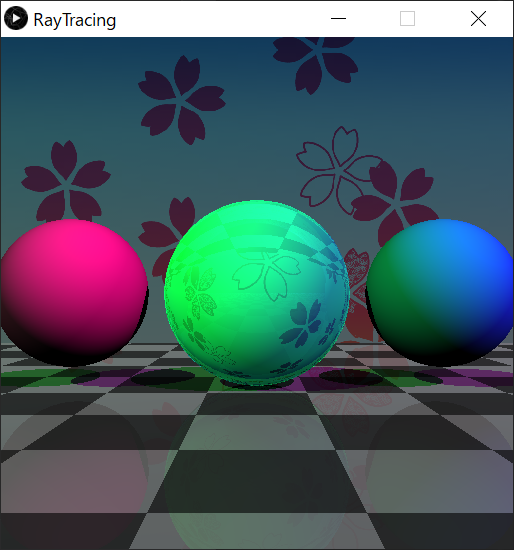
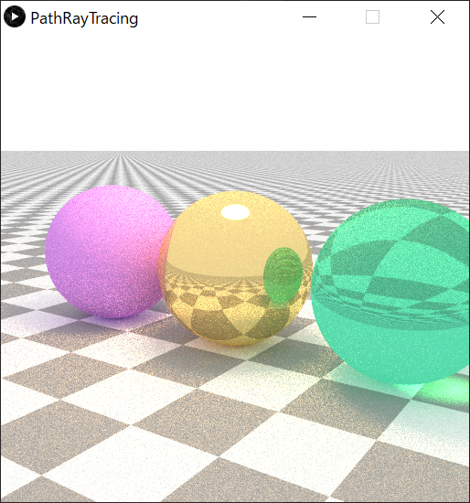

# scala-raytracing
Raytracing with scala and processing

scala + procesingでレイトレーシングするサンプル

CPU並列化してあるのでコア数が多ければ高速に描画されます

## Usage
IntelliJ IDEAでプロジェクトを開いて、RayTracingまたはPathTracingオブジェクトを直接実行する

## Images
サンプル実行画像
### Ray tracing

### Path tracing

## Reference
「[はじめようレイトレーシング](http://raytracing.xyz/)」を参考に実装しました。

